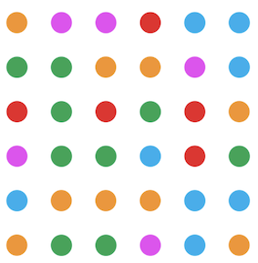

# Two_Dots
Solve challenging puzzles by connecting the dots
 

## Rules
At the start of each game, the user can choose either to eliminate the targetted amount of dots within a 
specified number of moves or within a time limit. The user must connect at least two dots of the same color 
to make a move and remove the dots. The dots can be connected horizontally or vertically, but
not diagonally, dots directly above those eliminated dots will then drop down to fill in the
gap. Throughout this specication document, each dot will be referred as to a colored
dot and a cell refers to the space occupied by a dot. In addition Row number increases
when moving from top to bottom and column number increases when moving from left to right.

## How to run the game
First run 'make' in current Two_Dots directly then run 'make demo'

## Test files
Run 'make test'
